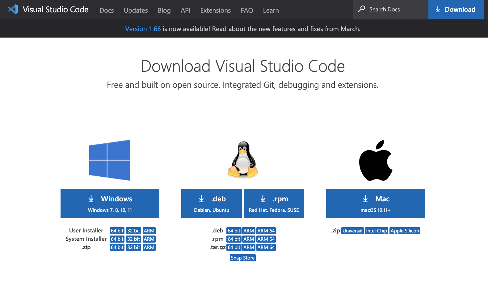
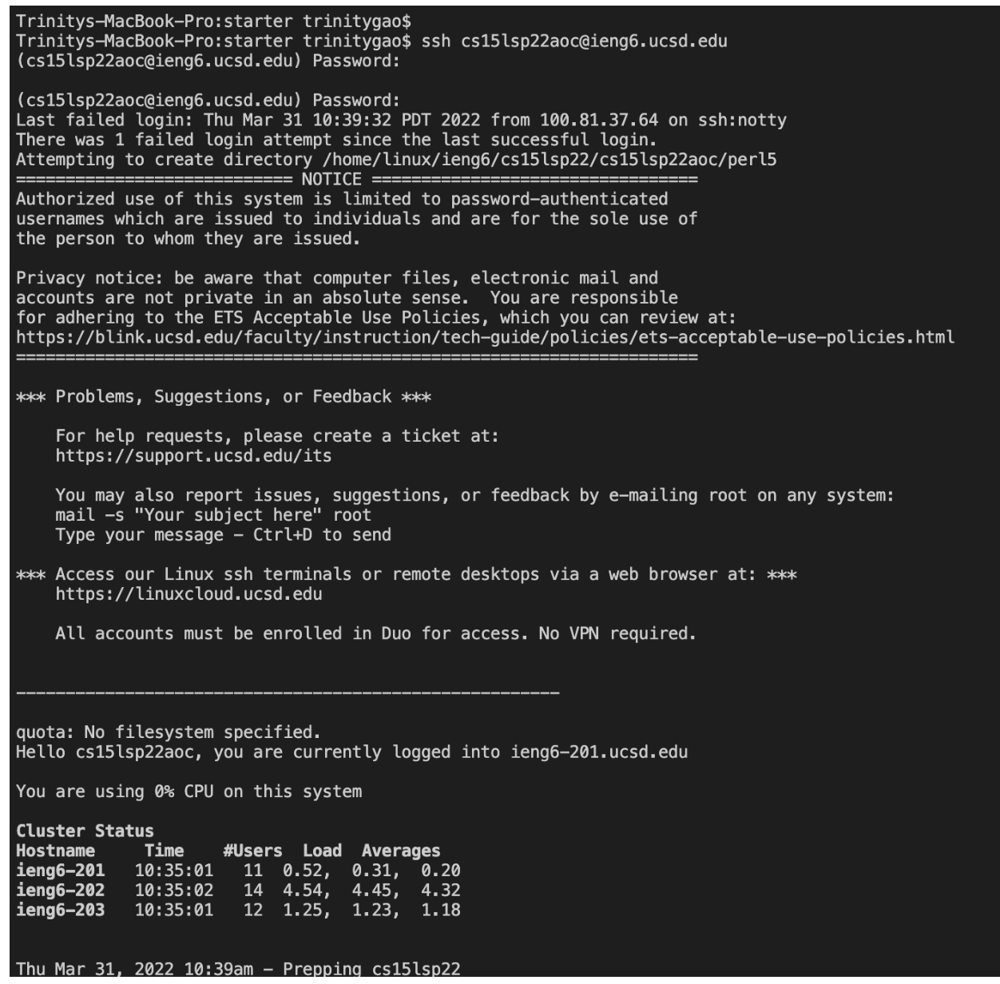
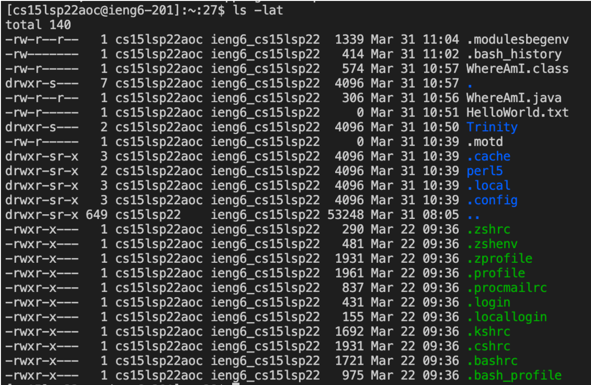
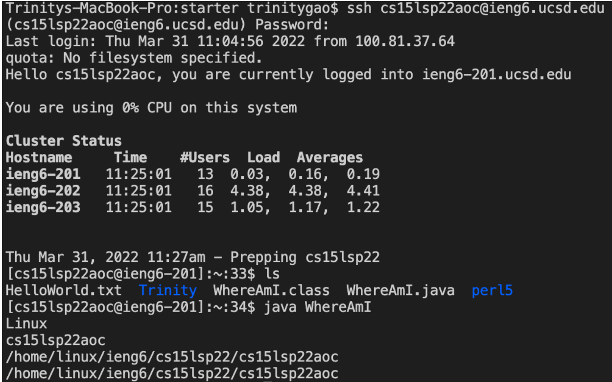
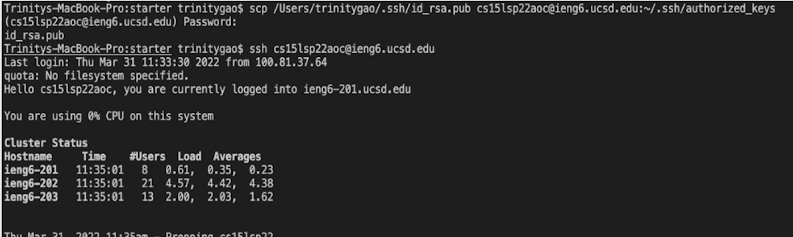
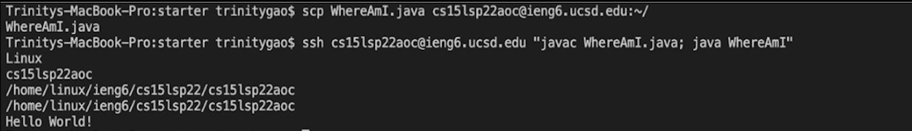

# CSE 15L Spring 2022: Lab Report 1
## How to log into a course-specific account on ieng6 ?

**Hello CSE 15L students!** Today I am going show you guys a quick tutorial about how to set up and log into your course-specific accoun and run some useful commands on the server computer. Just follow the steps and you can do it!  

NOTE: This tutorial is for Mac IOS system. Windows users have an extra step that is not included in this tutorial.

---

**1. Installing VScode**



- Before connecting your local computer to the server, you need to download VScode. You need to go to this website ([Link to VScode](https://code.visualstudio.com/)) and download VScode to your computer according to your system. 

---

**2. Remotely Connecting**
 
- The first step is to open up the terminal and enter this command. Remember to replace zz with the letters in your course-specific account. 

```
$ ssh cs15lsp22zz@ieng6.ucsd.edu
```
- You will see the following message when you are connecting to a new server for the first time. Please answer yes for the message and type in your password. Then, you should be logged in.

```
$ ssh cs15lsp22zz@ieng6.ucsd.edu

The authenticity of host 'ieng6.ucsd.edu (128.54.70.227)' can't be established.

RSA key fingerprint is SHA256:ksruYwhnYH+sySHnHAtLUHngrPEyZTDl/1x99wUQcec.

Are you sure you want to continue connecting (yes/no/[fingerprint])?
```
- This is the result when you successfully connected to the remote computer / server! You can use it as a reference. 



---

**3. Trying Some Commands**
- Try to run the following commands on both your computer and the remote computer. I marked their function next to the commands.

```
cd ~ // change back to home directory

cd // change directory

pwd // output the full path name of your current directory

ls -lat // list all files including entries starting with ‘.’ in the long format along with the times when they were modified.

ls -a // list all the existing files including entries starting with ‘.’

cp /home/linux/ieng6/cs15lsp22/public/hello.txt ~/ 
//cp is a command that copy the file. But it will be permission denied since you are not allow to access code created by other people

cat /home/linux/ieng6/cs15lsp22/public/hello.txt 
// cat is a command that create or view a file. But it will be permission denied because you are not allow to create or view a file at the another person's directory.
```

- This is our sample result after running the command **ls -lat**.



Note: To logout of the remote server in the terminal, you can: 
1. Ctrl-D
1. Run the command exit

---

**4. Moving Files with scp**
- Now, we will use a command called scp to copy a file from your computer to a remote computer. I will use a file called WhereAmI.java to demonstrate this.
- You should run this command after replacing the file name and zz with your file name and the letters in your course-specific account. You will need to input your password in order to login after running the command. 
```
//scp <File Name>.java cs15lsp22zz@ieng6.ucsd.edu:~/
scp WhereAmI.java cs15lsp22aoc@ieng6.ucsd.edu:~/
```
- After running the command, you should see the file appearing in your remote computer's home directory when you run the command ls. You should also be able to run the program file after compiling it. Our sample result is down below!



---

**5. Setting an SSH Key**
- Now, we will learn a great way to allow more efficient login process: *Setting up an SSH key*. SSH key works by a program called ssh-keygen. This program create a pair of files called the public key and private key. So, SSH command can use this pair of files in place of your password. After setting it up, you don't need to enter the password to login anymore!   

1. First, you need to create the SSH key file on your local computer by running the command **ssh-keygen**. The SSH key file are stored in the .ssh directory on your computer.

```
$ ssh-keygen
Generating public/private rsa key pair.

// use your own user name to replace <user-name>!
Enter file in which to save the key (/Users/<user-name>/.ssh/id_rsa): /Users/<user-name>/.ssh/id_rsa

// Note: Make sure that you DO NOT add a passphrase for this step. Just press enter.
Enter passphrase (empty for no passphrase): 
Enter same passphrase again: 

Your identification has been saved in /Users/<user-name>/.ssh/id_rsa.
Your public key has been saved in /Users/<user-name>/.ssh/id_rsa.pub.
The key fingerprint is:
SHA256:jZaZH6fI8E2I1D35hnvGeBePQ4ELOf2Ge+G0XknoXp0 <user-name>@<system>.local
The key's randomart image is:
+---[RSA 3072]----+
|                 |
|       . . + .   |
|      . . B o .  |
|     . . B * +.. |
|      o S = *.B. |
|       = = O.*.*+|
|        + * *.BE+|
|           +.+.o |
|             ..  |
+----[SHA256]-----+
```
2. Next, we need to copy the public key to the .ssh directory that is on your remote computer. In order to do so, you first need to login to the server. Then, you need to create a directory called **.ssh** on to server by running the following command. 
```
$ ssh cs15lsp22zz@ieng6.ucsd.edu // login to server
<Enter Password>
$ mkdir .ssh // create the .ssh directory
```
3. After that, you need to logout of the server and run the following command on your computer. You also need to enter your password for the last time. 
```
$ scp /Users/<user-name>/.ssh/id_rsa.pub cs15lsp22zz@ieng6.ucsd.edu:~/.ssh/authorized_keys
//Use your username for the command!
```
- Now, you should be able to login to the remote computer without password!



---

**6. Optimizing Remote Running**
- Here is a few command that will make your remote running more efficient!
```
1. $ ssh cs15lsp22zz@ieng6.ucsd.edu "ls"
// Write a command in quotes at the end of an ssh command will directly run it on the remote server and return the result to you.

2. javac WhereAmI.java; java WhereAmI
// use semicolons to run multiple commands on the same line
```
- A combination of these 2 command could be something like the following. You can use my result of running the command as a reference.
```
$ ssh cs15lsp22zz@ieng6.ucsd.edu "javac WhereAmI.java; java WhereAmI"
```


---

**This is the end of the tutorial! Good Job for making it to the end!**


