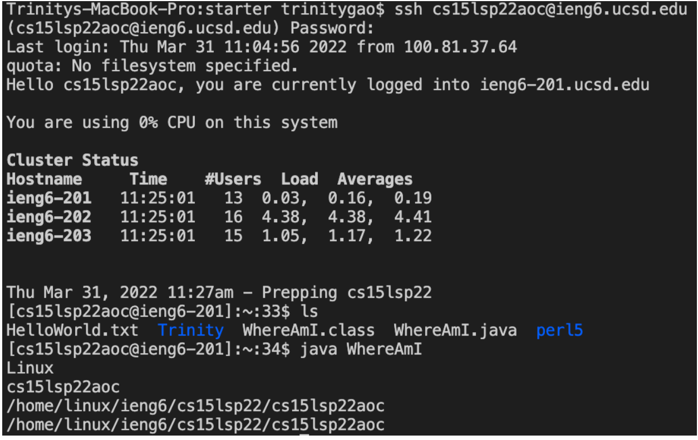

# CSE 15L Spring 2022: Lab Report 1
## How to log into a course-specific account on ieng6 ?

**Hello CSE 15L students!** Today I am going show you guys a quick tutorial about how to set up and log into your course-specific accoun and run some useful commands on the server computer. Just follow the steps and you can do it!  

NOTE: This tutorial is for Mac IOS system. Windows users have an extra step that is not included in this tutorial.

---

**1. Installing VScode**


- Before connecting your local computer to the server, you need to download VScode. You need to go to this website ([Link to VScode](https://code.visualstudio.com/)) and download VScode to your computer according to your system. 

---

**2. Remotely Connecting**
 
- The first step is to open up the terminal and enter this command. Remember to replace zz with the letters in your course-specific account. 

```
$ ssh cs15lsp22zz@ieng6.ucsd.edu
```
- You will see the following message when you are connecting to a new server for the first time. Please answer yes for the message and type in your password. Then, you should be logged in.

```
$ ssh cs15lsp22zz@ieng6.ucsd.edu

The authenticity of host 'ieng6.ucsd.edu (128.54.70.227)' can't be established.

RSA key fingerprint is SHA256:ksruYwhnYH+sySHnHAtLUHngrPEyZTDl/1x99wUQcec.

Are you sure you want to continue connecting (yes/no/[fingerprint])?
```
- This is the result when you successfully connected to the remote computer / server! You can use it as a reference. 


---

**3. Trying Some Commands**
- Try to run the following commands on both your computer and the remote computer. I marked their function next to the commands.
```
cd ~ // change back to home directory

cd // change directory

pwd // output the full path name of your current directory

ls -lat // list all files including entries starting with ‘.’ in the long format along with the times when they were modified.

ls -a // list all the existing files including entries starting with ‘.’

cp /home/linux/ieng6/cs15lsp22/public/hello.txt ~/ 
//cp is a command that copy the file. But it will be permission denied since you are not allow to access code created by other people

cat /home/linux/ieng6/cs15lsp22/public/hello.txt 
// cat is a command that create or view a file. But it will be permission denied because you are not allow to create or view a file at the another person's directory.

```
Note: To logout of the remote server in the terminal, you can: 
- Ctrl-D
- Run the command exit

**4. Moving Files with scp**
- Now we will use a command called scp to copy a file from your computer to a remote computer. I will use a file called WhereAmI.java to demonstrate this.
- You should run this command 
```
//scp <File Name>.java cs15lsp22zz@ieng6.ucsd.edu:~/
scp WhereAmI.java cs15lsp22aoc@ieng6.ucsd.edu:~/
```

**5. Setting an SSH Key**


**6. Optimizing Remote Running**



