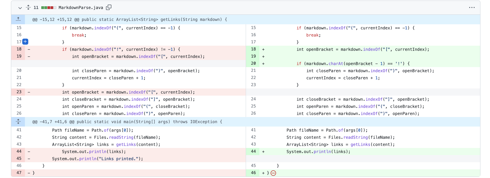
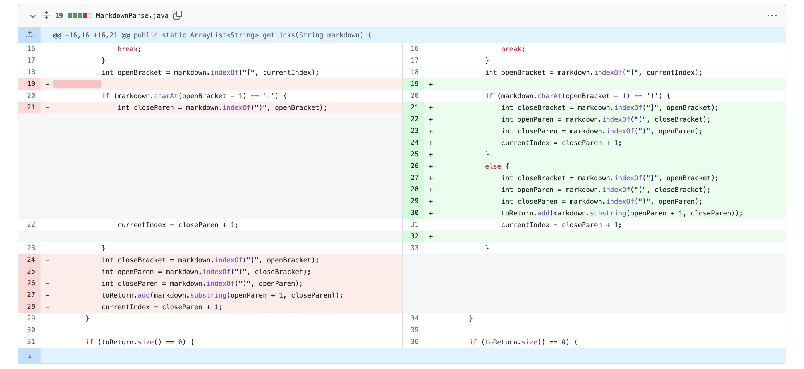

# CSE 15L Spring 2022: Lab Report 2
## Bug, Symptom, and Failure-inducing Input

**Hello CSE 15L students!** Today I am going to depict the relationship between bug, symptom, and failure-inducing input. 

---

**1. Infinite Loop**

- The image above is the code change in order to fix the infinite loop when encountering this [failure-inducing input](https://github.com/Trinnnn/markdown-parser/blob/main/test-file2.md?plain=1) regarding a different formatted link.

- The above image showed the symptom of that failure-inducing input. Here 

---

**2. Image Link Inclusion**

 
- The image above is the code change in order to fix the image link inclusion which is a wrong output when encountering this [failure-inducing input](https://github.com/Trinnnn/markdown-parser/blob/main/test-file3.md?plain=1).

---

**3. Index out of bound with Wrong Content Inclusion**

- The image above is the code change in order to fix the index out of bound and wrong content inclusion (including a string that is formatted like a link) when encountering this [failure-inducing input](https://github.com/Trinnnn/markdown-parser/blob/main/test-file1.8.md?plain=1).

