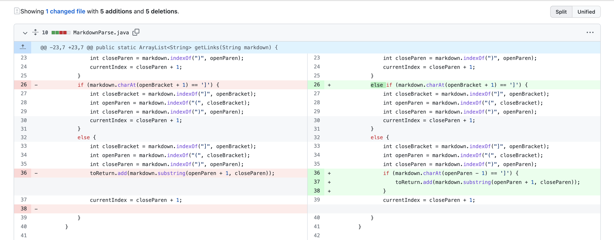
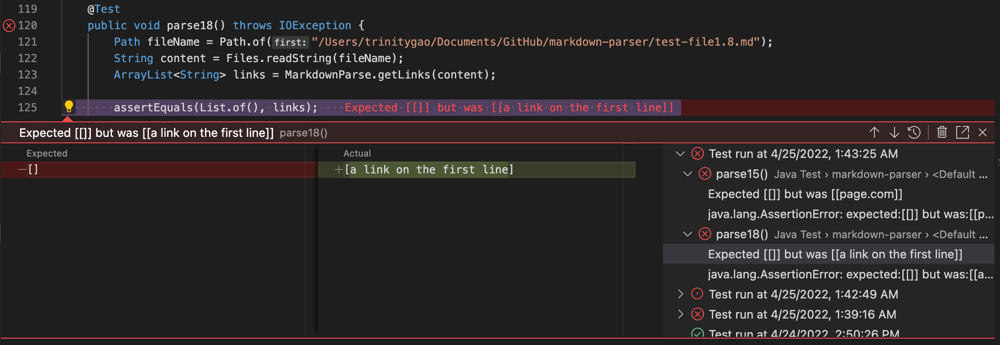

# CSE 15L Spring 2022: Lab Report 3
## Bug, Symptom, and Failure-inducing Input

**Hello CSE 15L students!** Today I am going to depict the relationship between bug, symptom, and failure-inducing input. 

---

**1. Infinite Loop**
- The image below is the code change in order to fix the infinite loop when encountering this [failure-inducing input](https://github.com/Trinnnn/markdown-parser/blob/main/test-file2.md?plain=1) regarding a different formatted link.

- The following image showed the symptom of that failure-inducing input. Here the program enters a state of infinite loop since the while loop doesn't break when it cannot find another normally formatted link in the file. 

> The bug here is that the while loop did not cover the cases where the file does not end with a link. For the infinite loop, multiple failure-inducing inputs can lead to the symptom such as a extra line at the end. As long as the file does not end with a link, the symptom will persist. Also, the bug will appear again if an input manage to not trigger the if statement after all the link are parsed. 
---

**2. Image Address Inclusion**
- The image below is the code change in order to fix the image address inclusion which is a wrong output when encountering this [failure-inducing input](https://github.com/Trinnnn/markdown-parser/blob/main/test-file3.md?plain=1).

 
- The following image showed the symptom of that failure-inducing input. Here the program parsed an image address as a link and added it to the output arraylist because the image's markdown format is similar to that of the link.

> The failure-inducing input is the image address, causing the program to produce the wrong output. It triggers the bug in the program which is the way we parse anything that has the same format as the link unconditionally. There are more than one failure-inducing inputs to trigger the bug. As long as the positioning of bracket and parenthesis is similar to the link's markdown format, the bug will be triggered. After the bug is triggered, it produces the wrong output which is the symptom for us to see. 
---

**3. Index out of bound with Wrong Content Inclusion**
- The image below is the code change in order to fix the index out of bound and wrong content inclusion (including a string that is formatted like a link) when encountering this [failure-inducing input](https://github.com/Trinnnn/markdown-parser/blob/main/test-file1.8.md?plain=1).

The following are the symptoms of the failure-inducing input.
- Index out of bound for test case 8:
> The index out of bound is caused by the if statement to fix the bug for image address inclusion. We did not take into consideration that the openBracket's index may be zero in certain cases and minus one would then trigger an error, which is a bug that need to be fixed. The bug and symptom relationship are one to one since specifying the index bound eliminate the bug and the symptom all together. 

- Wrong Output for test case 8 after fixing index out of bound symptom. Here the program parsed a random string as the link since the string has a similar format to the link.
> The program produces the wrong output here because it did not include a condition that empty bracket before the actual link is not acceptable. This is a bug within the program. Any empty bracket combined with an string with in parenthesis can fool the program to produce the wrong output. Here the wrong output into the arraylist is the symptom. Different bugs and failure-inducing input could lead to the same symptom: wrong output. I am just showing you one example here. 

