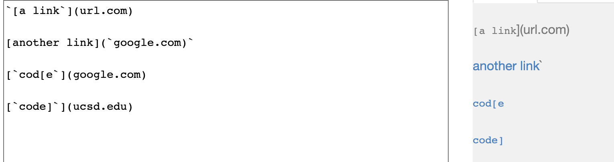
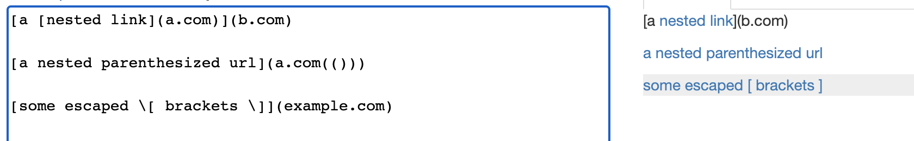
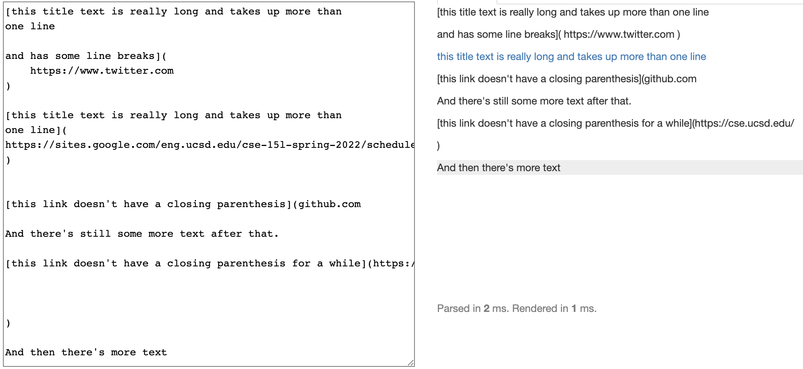
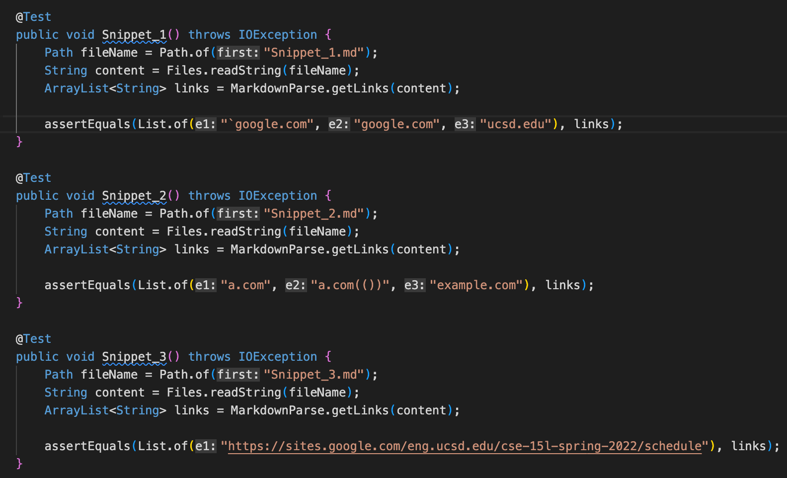
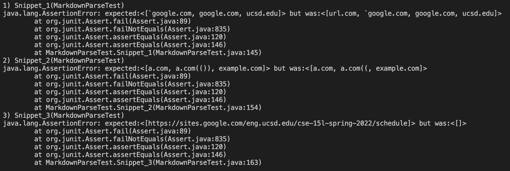
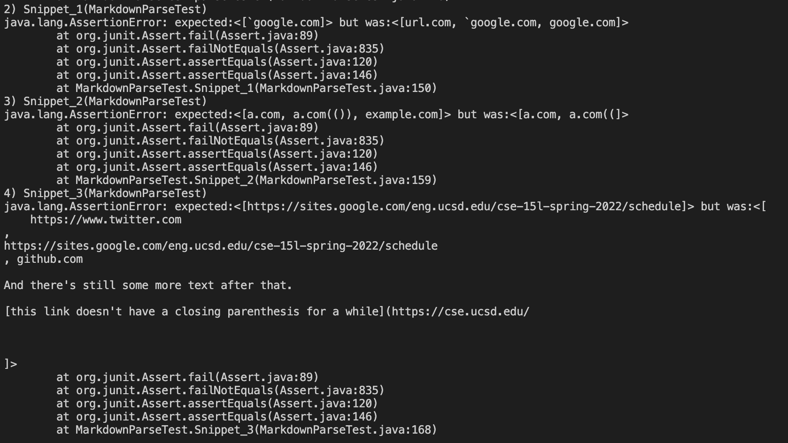

# CSE 15L Spring 2022: Lab Report 4

- My markdown-parse Repository: https://github.com/Trinnnn/markdown-parser
- Week 7 Reviewed markdown-parse repository: https://github.com/cynthia-bao/markdown-parser

**Expected Output for Snippet 1**
-
```
[`google.com, google.com, ucsd.edu]
```


**Expected Output for Snippet 2**
-
```
[a.com, a.com(()), example.com]
```


**Expected Output for Snippet 3**
-
```
[https://sites.google.com/eng.ucsd.edu/cse-15l-spring-2022/schedule]
```


**Code for Testing Lab 4 markdown Snippets**
-


**Test Result for my Implementation**
-
- All three test for markdown Snippet 1, 2, and 3 failed.


**Test Result for the Implementation I Reviewed**
-
- All three test for markdown Snippet 1, 2, and 3 failed.


**Possible Solution for Snippet 1**
> There is a small code change that will make my program work for snippet. If I add an additional condition to the if statement at line 22 regarding not allowing the link to be parse if a backtick exist before the open bracket. However, this small change does not account for all related cases that use inline code with backticks, because a single backtick before open bracket would not interfere with the link format. A possible small code change that account for this could be a way to search for the occurence of matching backticks within a line of markdown link format. 

- Small change in line 22 : 

```
if (openBracket >= 1 && (markdown.charAt(openBracket - 1) == '!' || markdown.charAt(openBracket - 1) == '`')) {
```

**Possible Solution for Snippet 2**
> There is a possible small code change that will make my program work for snippet 2 and all related cases that nest parentheses, brackets, and escaped brackets. Currently, my program uses indexOf as the method to find the index of close parenthesis starting from open parenthesis. The failed test is due to fact that indexOf return the index of close parenthesis at its first occurrence, starting at the open parenthesis. Therefore, a possible small code change could be a way to search for the last occurence of close parenthesis instead of the first occurence if we make sure that this string is a link format. 

**Possible Solution for Snippet 3**
> I do not think that there is a small code change that  will make my program work for snippet 3 and all related cases that have newlines in brackets and parentheses, because of the various subtle code change that makes a link format have newlines in brackets and parentheses work or fail. Here, we cannot simply search for the combination of parentheses and brackets to parse link into an arraylist. We have to account for the possibility of missing parentheses and brackets while limiting the search for those (to not include the brackets or parentheses from random places). Also, we need a way to not parse the link format with an new line between them. 