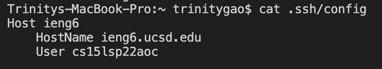
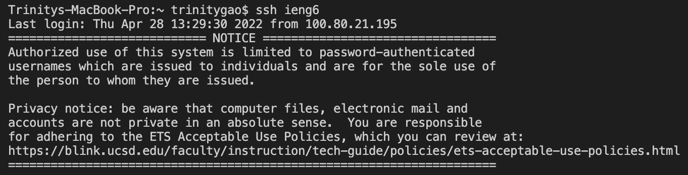

# CSE 15L Spring 2022: Lab Report 3

**Hello CSE 15L students!** Today I am going to demonstrate streamline ssh sonfiguration, setup Github access from ieng6, and copy whole directories with scp-r.

---

**1. Streamline ssh configuration**
> By streamlining the ssh configuration, the user is able to login to the ssh account more efficiently. In order to set it up, you first need to create a new file using the touch command and store the file at the .ssh directory. Then, use the nano command to edit config and add the following content in the image. This include the host, host name, and the user name. After that, you should be able to streamline ssh configuration by running "ssh ieng6". 
- config file content

- Using nano command to edit the file

- Streamlining ssh configuration after setup

---

**2. Setup Github access from ieng6**
> Setting up Github access from ieng6 allow users to edit, add, commit, push, and pull changes at the remote server: ieng6. First, you need to generate the public and private key using the ssh-keygen command. Then, you should add the public key you made to Github at the setting page. After that, you should be able push changes of repository to Github from ieng6 server. 
- Github Key Setup

- ssh public and private keys (id_rsa.pub & id_rsa)

- Pushing changes of repository from ieng6 server to Github

---

**3. Copy whole directories with scp-r**
> scp -r command enables you to copy the entire repository from your local computer to the remote server: ieng6. First, you should run the scp -r command with your ssh configuration and local repository name just like the following image. Then, you should be able to run the JUnit test in the remote server. You could also combine commands of copying repository and running JUnit test in one line to speed up the process.
- Copying the local repository to remote server using scp -r

- Compiling and running JUnit test on the ieng server

- Combining scp and ssh to copy repository and run test in one line

