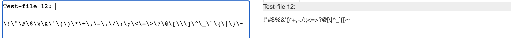
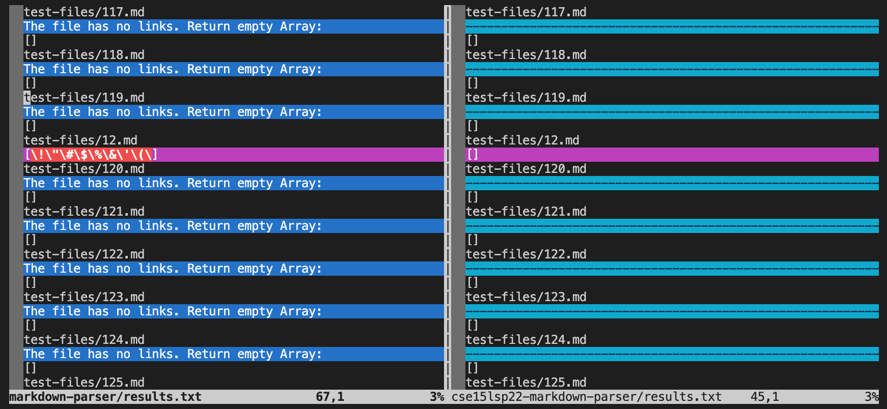
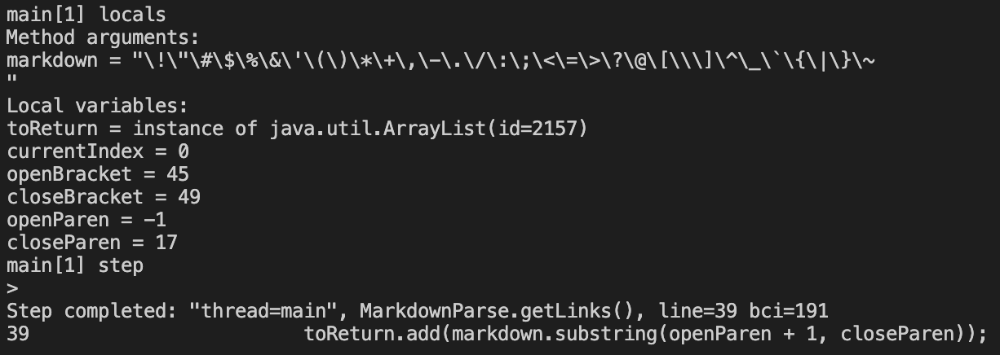
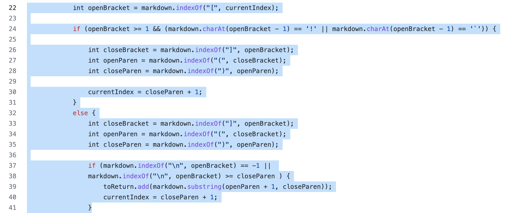
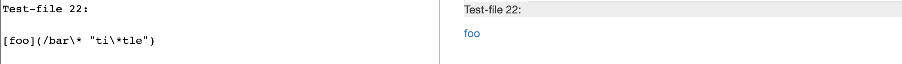
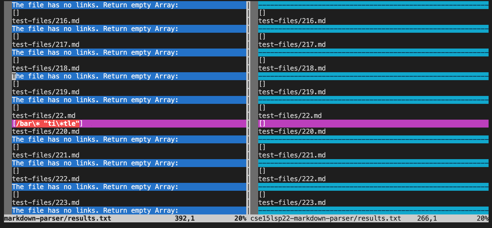

# CSE 15L Spring 2022: Lab Report 5
- My Markdown Parser implementation for **test files 12 and 22** had different answers than the implementation we provided for lab 9

---

- I found the test with different test results by using vimdiff on the results of running a bash for loop. Specifically, **“bash script.sh > results.txt”** was run to put the result into an txt file. 

---

Here is the link to the test files: 

> [Link to Test-file 12](https://github.com/nidhidhamnani/markdown-parser/blob/main/test-files/12.md?plain=1)

> [Link to Test-file 22](https://github.com/nidhidhamnani/markdown-parser/blob/main/test-files/22.md?plain=1)

---

**Test File 12**

> **Expected Output:**

> **Actual Output:**

(Left: My implmentation; Right: Lab 9 implementation)

- For test file 12, lab 9's implementation is right. Test file 12 does not have links, but my implementation still parsed a part of it as a link. Lab 9’s implementation returned an empty array list which is right.

**Fix for My Implementation**

> From the JDB, you can see that because my MarkdownParse did not find any violation of the if statement at linke 24. So, it enters the else statement automatically. Since the open bracket and the close bracket is located after  in test file 12, the index of open parenthesis returned -1. However, it was able to find close parenthesis at index 17 from index -1. Since the if statement at 37 was not violated, my MarkdownParse try to add the string between open parenthesis + 1 and close parenthesis. So, a weird part of test file 12 was parsed into the array list. 

---

**Test File 22**

> **Expected Output:**

> **Actual Output:**

(Left: My implmentation; Right: Lab 9 implementation)

- For test file 22, my implementation is right. The expected output matches my result of foo being a link. My implementation parsed the link while Lab 9’s implementation outputs an empty array list.

**Fix for Lab 9 Implementation**

---